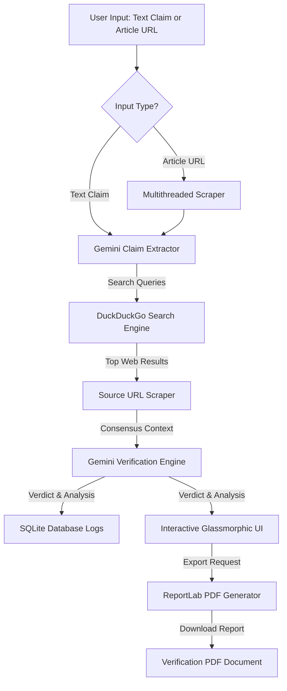

# ⚡ TruthLens: Dynamic Fake News Detection System

**TruthLens** is a production-ready, real-time news verification platform designed for high accuracy and performance on low-resource systems. It leverages the latest Gemini AI models and real-time search queries to bring transparency and verification back to the digital world.

Unlike traditional detectors that rely on static, outdated datasets, TruthLens performs **Internet-Verified AI Analysis**. It fetches live information from the web to check the validity of breaking news stories, claims, and articles instantly.

---

## 📸 System Architecture & Data Flow

TruthLens processes claims through a pipeline that combines real-time scraping, search query generation, consensus analysis, and semantic highlighting:



---

## 🚀 Key Features

- **🌍 Real-time Web Verification**: Every analysis triggers a live search to cross-reference claims with trusted internet sources.
- **🧠 Intelligent Gemini Engine**: Powered by Google's **Gemini Flash** models (`gemini-flash-latest` and `gemini-2.0-flash-lite`) to extract claims, evaluate source credibility, and perform high-speed reasoning.
- **🎨 Futuristic UI/UX**: A sleek, responsive "Glassmorphism" interface with neon accents, smooth page transitions, and a responsive result dashboard.
- **📊 Detailed Result Dashboard**:
  - **Verdict**: Dynamic classification of `REAL`, `FAKE`, or `MISLEADING`.
  - **Confidence Meter**: Visual progress bar and counter showing the model's certainty level.
  - **AI Reasoning**: Explains *why* a claim is flagged, citing specific source inconsistencies.
  - **Verified Sources**: Clickable citation cards linking to the actual articles used for verification.
  - **Keyword Heatmap & Highlighting**: Automatically identifies and highlights suspicious/key words in the original text.
- **📜 History Tracking**: Access previous analyses, complete with verdicts, metadata, and timestamps.
- **⚡ Performance Optimized**: Uses multi-threaded scraping (`ThreadPoolExecutor`) and lightweight processing to ensure zero lag on average hardware.
- **📄 Professional PDF Export**: Generate and download beautifully formatted PDF verification reports.

---

## 🛠️ Technology Stack

| Component | Technology | Description |
| :--- | :--- | :--- |
| **Backend Framework** | Python 3.9+ / Flask | Core server routing and request handling. |
| **Production Server** | Waitress WSGI | High-concurrency production-ready web server. |
| **AI Verification** | Google Gemini (via `google-genai` SDK) | Core extraction, consensus analysis, and verdict reasoning. |
| **Search Engine** | DuckDuckGo Search (via `ddgs`) | Real-time web-querying without requiring API keys. |
| **Web Scraping** | BeautifulSoup4 & Requests | Parallel extraction of news articles and search sources. |
| **Database** | SQLite3 | Local storage of search history, classifications, and metadata. |
| **Frontend** | HTML5 / CSS3 / JavaScript ES6+ | Glassmorphic design, responsive layouts, and interactive animations. |
| **PDF Reporting** | ReportLab | Programmatic generation of verification documents. |

---

## 📂 Project Structure

```text
FakeNewsDetector/
│
├── app.py                  # Main Flask application and server routing
├── config.py               # Central configuration (API keys, models, paths, limits)
├── database.db             # SQLite3 database storing history (auto-generated)
├── database.py             # Database schemas, connections, and query operations
├── requirements.txt        # Python package dependencies
│
├── model/
│   └── verifier.py         # Main verification agent using Gemini & web searches
│
├── scraper/
│   └── scraper.py          # Multithreaded BeautifulSoup web article scraper
│
├── static/
│   ├── css/
│   │   └── style.css       # Core stylesheets (Glassmorphic theme, animations)
│   └── js/
│       └── main.js         # Frontend interactive scripts and utilities
│
├── templates/
│   ├── base.html           # Main layout template (navbar, footer, assets imports)
│   ├── home.html           # TruthLens home landing page
│   ├── input.html          # Claim/URL submission page with loading status
│   ├── result.html         # Rich analysis dashboard (verdict, meter, sources, highlights)
│   └── history.html        # Historical verification logs database view
│
└── utils/
    └── pdf_generator.py    # ReportLab utility to export reports as PDF
```

---

## ⚙️ Installation & Setup

### 1. Prerequisites
Ensure you have Python 3.9+ installed on your machine.

### 2. Clone the Repository
Clone the project directory to your local drive and navigate into it:
```bash
cd FakeNewsDetector
```

### 3. Set Up a Virtual Environment (Recommended)
Create and activate a virtual environment to manage dependencies locally:
```bash
# Windows
python -m venv venv
venv\Scripts\activate

# macOS / Linux
python3 -m venv venv
source venv/bin/activate
```

### 4. Install Dependencies
Install all required libraries using the package manager:
```bash
pip install -r requirements.txt
```

> [!NOTE]
> During installation, you might see a runtime warning saying `This package (duckduckgo_search) has been renamed to ddgs!`.
> The code in `model/verifier.py` automatically handles this and utilizes the updated libraries properly. No action is required.

### 5. API Configuration
1. Obtain a free **Gemini API Key** from [Google AI Studio](https://aistudio.google.com/).
2. Open `config.py` in your editor and update the API key:
   ```python
   GEMINI_API_KEY = 'YOUR_ACTUAL_GEMINI_API_KEY'
   ```
3. (Optional) Adjust the default settings like `PRIMARY_MODEL`, `FALLBACK_MODEL`, or toggle `ENABLE_DYNAMIC_VERIFICATION`.

### 6. Run the Application
Start the waitress production server by executing:
```bash
python app.py
```
Once started, open your web browser and navigate to:
```text
http://127.0.0.1:5000
```

---

## 🧪 How to Use

1. **Access the Tool**: Click the **Analyze** tab in the top navigation bar.
2. **Submit Content**:
   - Paste a **URL** of a news article to automatically scrape its text.
   - *OR* paste a raw **Claim / Text Snippet** directly in the text area.
3. **Verify**: Click **Verify Claim**. The system will show a progress screen while it extracts claims, performs web searches, and processes findings.
4. **View Verdict**: Read the classification (`REAL`, `FAKE`, or `MISLEADING`), see the confidence meter score, inspect the AI reasoning explanation, and review highlighted keywords.
5. **Verify Citations**: Check the listed **Verified Sources** to read the primary news articles.
6. **Export Report**: Click **Download Report** to save a PDF report.

---

## 🛠️ Troubleshooting

### 1. Gemini Quota Exceeded (429 / RESOURCE_EXHAUSTED)
If the API rate limits are hit (especially on free tier accounts):
- **Solution**: The system will automatically perform exponential backoff retries. If the error persists, it will attempt a fallback model (`gemini-2.0-flash-lite`). Simply wait a few seconds and submit again.

### 2. Changes to Code or Configuration Not Reflecting
The application uses the `Waitress` production web server, which does not support auto-reloading.
- **Solution**: Whenever you edit `config.py` or backend files (like `verifier.py` or `app.py`), you must stop the terminal process (`Ctrl+C`) and start the application again with `python app.py`.

### 3. Search Failures / Timeout Errors
If DuckDuckGo Search fails due to network limitations or temporary blocks:
- **Solution**: The verification engine has robust fallbacks. If no live web sources can be indexed or fetched, it will analyze the claim based on general consensus patterns and note in the reasoning that "Live data is still propagating".

---

*TruthLens — Bringing Transparency Back to the Digital World.*
